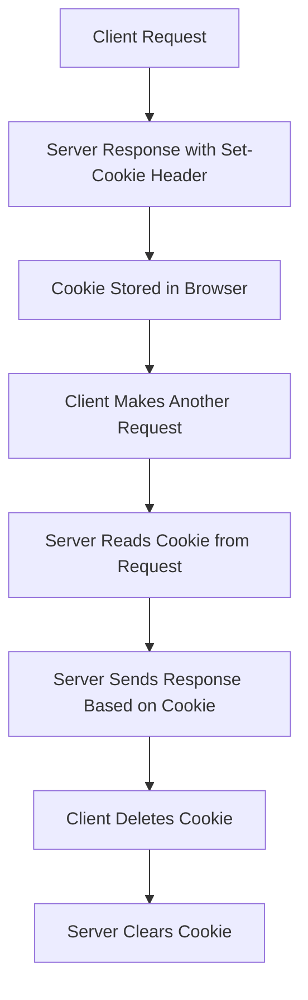

### COOKIES 🍪

#### **1. Introduction to Cookies**

Cookies are small pieces of data that a server sends to the browser, which then stores them and sends them back with subsequent requests to the same server. They are often used to store session data, user preferences, and other small pieces of information.

Cookies can be set by the server in the response headers and sent by the browser in the request headers.

#### **2. What Are Cookies Used For?**

* **Session Management:** Used to store session data (e.g., logged-in users).
* **Personalization:** Stores user preferences such as language, themes, etc.
* **Tracking and Analytics:** To track users across sessions for analytics and advertisement purposes.

#### **3. Structure of a Cookie**

A cookie consists of:

* **Name:** The key used to reference the cookie.
* **Value:** The value of the cookie.
* **Domain:** The domain to which the cookie belongs.
* **Path:** The URL path to which the cookie is available.
* **Expires:** When the cookie should expire (if not set, it will expire when the browser is closed).
* **Secure:** Whether the cookie should be sent only over HTTPS.
* **HttpOnly:** Whether the cookie is inaccessible via JavaScript.

#### **4. Setting Cookies in Node.js with Express**

In Express, you can set cookies using the `res.cookie()` method. Here is an example:

```js
const express = require('express');
const app = express();
const port = 3000;

app.get('/set-cookie', (req, res) => {
  res.cookie('user', 'JohnDoe', { httpOnly: true, maxAge: 3600000 }); // Sets cookie for 1 hour
  res.send('Cookie is set');
});

app.listen(port, () => {
  console.log(`Server running at http://localhost:${port}`);
});
```

* **Explanation:**

    * `user`: Cookie name
    * `'JohnDoe'`: Cookie value
    * `{ httpOnly: true, maxAge: 3600000 }`: Optional cookie attributes like:

        * `httpOnly`: Cookie is inaccessible via JavaScript (helps with security).
        * `maxAge`: Cookie expiration time in milliseconds (3600000 ms = 1 hour).

#### **5. Reading Cookies in Node.js with Express**

To read cookies in Express, you need the `cookie-parser` middleware. It parses cookies and makes them available in `req.cookies`.

```bash
npm install cookie-parser
```

Then in your Express app:

```js
const express = require('express');
const cookieParser = require('cookie-parser');
const app = express();
const port = 3000;

app.use(cookieParser());

app.get('/get-cookie', (req, res) => {
  const user = req.cookies.user;
  if (user) {
    res.send(`Hello ${user}`);
  } else {
    res.send('No cookie found');
  }
});

app.listen(port, () => {
  console.log(`Server running at http://localhost:${port}`);
});
```

* **Explanation:**

    * `cookie-parser` is used to parse the cookies and make them available in `req.cookies`.
    * `/get-cookie` route checks for the `user` cookie and responds accordingly.

#### **6. Deleting Cookies in Node.js with Express**

To delete a cookie, you can use the `res.clearCookie()` method. You should pass the name of the cookie you want to delete.

```js
app.get('/delete-cookie', (req, res) => {
  res.clearCookie('user');
  res.send('Cookie has been deleted');
});
```

* **Explanation:**

    * This deletes the `user` cookie by setting its value to `null` and sending it in the response.

#### **7. Example Flow of Setting, Reading, and Deleting Cookies**

Let's combine everything into one application:

```js
const express = require('express');
const cookieParser = require('cookie-parser');
const app = express();
const port = 3000;

app.use(cookieParser());

// Route to set a cookie
app.get('/set-cookie', (req, res) => {
  res.cookie('user', 'JohnDoe', { httpOnly: true, maxAge: 3600000 });
  res.send('Cookie is set');
});

// Route to get a cookie
app.get('/get-cookie', (req, res) => {
  const user = req.cookies.user;
  if (user) {
    res.send(`Hello ${user}`);
  } else {
    res.send('No cookie found');
  }
});

// Route to delete a cookie
app.get('/delete-cookie', (req, res) => {
  res.clearCookie('user');
  res.send('Cookie has been deleted');
});

app.listen(port, () => {
  console.log(`Server running at http://localhost:${port}`);
});
```

#### **8. Mermaid Diagram: Flow of Cookies in a Web Application**

Below is a mermaid diagram that shows the typical flow of setting, reading, and deleting cookies.



* **Explanation:**

    * The client makes a request.
    * The server responds with a `Set-Cookie` header.
    * The browser stores the cookie and sends it back to the server with future requests.
    * The server can then read the cookie and respond accordingly.
    * The client can request to delete the cookie, and the server will clear it.

#### **9. Security Considerations with Cookies**

When working with cookies, it's essential to ensure that they are secure:

* **Use HttpOnly Cookies:** Prevent access to cookies via JavaScript.
* **Use Secure Cookies:** Ensure cookies are only sent over HTTPS connections.
* **SameSite Attribute:** Helps mitigate cross-site request forgery (CSRF) attacks.

Example of setting a secure cookie:

```js
res.cookie('sessionId', '12345', { httpOnly: true, secure: true, sameSite: 'Strict' });
```

* **Explanation:**

    * `secure: true` ensures the cookie is only sent over HTTPS.
    * `sameSite: 'Strict'` ensures the cookie is sent only with same-site requests (mitigating CSRF).
